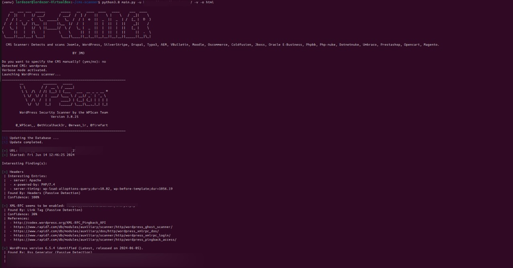

# CMS Vulnerability Scanner

## Overview
The CMS Vulnerability Scanner is a comprehensive and robust tool designed to detect and analyze security vulnerabilities in various Content Management Systems (CMS). It supports a wide range of CMS platforms and provides detailed reports on potential security issues, making it an essential tool for security professionals and developers alike.



## Features
- **Multi-CMS Support**: Detects and scans popular CMS platforms including Joomla, WordPress, SilverStripe, Drupal, Typo3, AEM, VBulletin, Moodle, Oscommerce, Coldfusion, JBoss, Oracle E-Business, PhpBB, Php-Nuke, DotNetNuke, Umbraco, PrestaShop, OpenCart, and Magento.
- **Comprehensive Detection**: Utilizes a combination of signature-based and heuristic methods to accurately identify the CMS in use.
- **Progressive Scanning**: Updates the number of modules scanned on a single line for a clean and concise display.
- **Detailed Reporting**: Generates detailed scan reports in multiple formats (text, PDF, HTML) for easy analysis and documentation.
- **CVE Integration**: Fetches and displays relevant Common Vulnerabilities and Exposures (CVEs) for detected services, providing actionable insights into potential security risks.
- **Nmap Integration**: Includes fallback scanning with Nmap for comprehensive vulnerability assessment.
- **Extensive Configuration**: Customizable through configuration files to tailor the scanning process to specific needs and environments.
- **Logging**: Detailed logging of scanning activities and results for audit and review purposes.

## Added Value
Unlike many other CMS scanners, the CMS Vulnerability Scanner provides a holistic approach to security assessment with the following added benefits:
- **Multi-CMS Capability**: Support for a broader range of CMS platforms compared to many single-CMS focused tools.
- **Enhanced User Experience**: The integration of single-line progress updates for Droopescan reduces clutter and improves readability of scan progress.
- **Detailed and Multi-Format Reporting**: The ability to generate reports in multiple formats (text, PDF, HTML) sets it apart by offering flexibility in how scan results are consumed and shared.
- **CVE Integration**: Direct integration with CVE databases to provide up-to-date information on known vulnerabilities, which is often not available in other CMS scanners.
- **Extensible Configuration**: Highly customizable to adapt to different environments and requirements, making it suitable for both small scale and enterprise use.

## Installation
To install the CMS Vulnerability Scanner, follow these steps:

1. Clone the repository:
   ```bash
   git clone https://github.com/lordozer/cms-scanner.git
   cd cms-vulnerability-scanner
2. Make the setup script executable:
   ```bash
   chmod +x setup_[os].sh

3. Run the setup script:
   ```bash
   ./setup_[os].sh

This installation process has been tested on both Kali Linux and Ubuntu.

## Usage

To run the scanner, use the following command:

**for ubuntu :**
  ```bash
  source /menv/bin/activate
  python main.py -u <URL> [-v] [-o <output format>]
  ```
**for kali :**
 ```bash
  python main.py -u <URL> [-v] [-o <output format>]
  ```
-u, --url: The URL of the site to scan (required).

-v, --verbose: Enable verbose mode (optional).

-o, --output: Specify the output format (choices: 'pdf', 'html', 'text'; default: 'text').

Example:

python main.py -u https://example.com -v -o pdf

Prompt for Manual CMS Selection:

**If you prefer to specify the CMS manually, the tool will prompt you:**

Do you want to specify the CMS manually? (yes/no): yes

Please specify the CMS (joomla, wordpress, silverstripe, drupal, typo3, aem, vbscan, moodle, oscommerce, coldfusion, jboss, oracle_e_business, phpbb, php_nuke, dotnetnuke, umbraco, prestashop, opencart, magento): wordpress

## Configuration
The tool uses config.json for CMS-specific settings and logging_config.py for logging configuration. Modify these files to customize the behavior and logging of the tool according to your needs.

Sample Configuration (config.json)
```json
{
  "joomla": {
    "common_files": [
      "administrator/manifests/files/joomla.xml",
      "administrator/templates/system/css/system.css",
      "media/system/js/mootools-core.js",
      "libraries/cms/version/version.php",
      "libraries/cms/version/version.php-dist"
    ]
  },
}
```
## Logging

The tool logs its activity to scanner.log. The log file is managed by a rotating file handler to ensure that log size is kept under control. The logging configuration can be adjusted in logging_config.py.

## Contributing
Contributions are welcome! Please fork the repository and create a pull request with your changes. Ensure that your code follows the existing style and includes appropriate tests.

## Contact
For any questions or support, please open an issue on the repository.


JMO.
